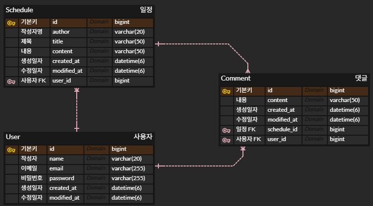

# 📅 일정 관리 과제 (Advanced Schedule Management)

> **"Spring Boot 4.0.2 기반의 세션 인증과 Soft Delete를 구현한 고성능 일정 관리 API"**

[](https://openjdk.java.net/)
[](https://spring.io/projects/spring-boot)
[](https://www.mysql.com/)
[](https://spring.io/projects/spring-data-jpa)
[](https://documenter.getpostman.com/view/47102193/2sBXcAKNsi)

---

## 📖 프로젝트 소개

**Spring Boot 4.0.2** 프레임워크를 기반으로 구축된 일정 관리 백엔드 서비스입니다.
단순한 CRUD를 넘어, **데이터 보존(Soft Delete)** 전략과 **세션(Session) 기반의 보안 인증** 시스템을 구축하여 데이터 무결성과 보안성을 동시에 확보했습니다.

### ✨ 핵심 기능 및 기술적 도전
* **Spring Boot 4.0.2 사용**: 최신 안정화 버전을 적용하여 최적화된 성능과 보안 패치 적용
* **🔐 세션 기반 인증 (Session Auth)**: `HttpSession`을 활용하여 서버 측에서 로그인 상태를 안전하게 관리하고 권한을 제어 (로그인한 사용자만 본인의 일정 수정/삭제 가능)
* **🗑️ 소프트 딜리트 (Soft Delete)**: `@SoftDelete`를 활용, DB에서 물리적으로 데이터를 삭제하지 않고 `deleted = true` 상태로 보존하여 데이터 복구 가능성 확보
* **🛡️ 견고한 예외 처리**: `GlobalExceptionHandler`를 통해 검증(`@Valid`) 실패와 비즈니스 로직 예외를 일관된 JSON 포맷으로 응답
* **📄 페이지네이션**: 대용량 데이터 조회 성능을 고려한 Spring Data JPA 페이징(`Pageable`) 적용
* **⏰ JPA Auditing**: `@EnableJpaAuditing`과 `BaseEntity`를 활용하여 생성일/수정일을 자동으로 관리

---

## 시스템 아키텍처

### 1. ERD (Entity Relationship Diagram)
사용자(`User`)는 여러 일정(`Schedule`)과 댓글(`Comment`)을 가질 수 있으며, 모든 데이터는 물리적으로 삭제되지 않고 `deleted` 플래그로 관리됩니다.



<details>
<summary><b>🗄️ 데이터베이스 스키마 상세 보기 (Click)</b></summary>
<div markdown="1">

#### 1. 사용자 (User)
| 컬럼명 | 타입 |       제약조건       | 설명 |
|:---:|:---:|:----------------:|:---|
| **id** | `BIGINT` |  PK, AI (자동 증가)  | 사용자 고유 ID |
| **email** | `VARCHAR(255)` | Unique, Not Null | 로그인 이메일 |
| **password** | `VARCHAR(255)` |     Not Null     | 암호화된 비밀번호 (BCrypt) |
| **name** | `VARCHAR(20)` |     Not Null     | 사용자 이름 |
| **created_at** | `DATETIME` |     Not Null     | 생성일 (BaseEntity) |
| **modified_at** | `DATETIME` |     Not Null     | 수정일 (BaseEntity) |
| **deleted** | `BOOLEAN` | Default `false`  | Soft Delete 여부 |

#### 2. 일정 (Schedule)
| 컬럼명 | 타입 |      제약조건       | 설명             |
|:---:|:---:|:---------------:|:---------------|
| **id** | `BIGINT` | PK, AI (자동 증가)  | 일정 고유 ID       |
| **user_id** | `BIGINT` |  FK (User.id)   | 작성자 ID         |
| **title** | `VARCHAR(50)` |    Not Null     | 일정 제목          |
| **content** | `VARCHAR(50)` |    Not Null     | 일정 내용          |
| **author** | `VARCHAR(20)` |    Not Null     | 작성자명           |
| **created_at** | `DATETIME` |    Not Null     | 생성일            |
| **modified_at** | `DATETIME` |    Not Null     | 수정일            |
| **deleted** | `BOOLEAN` | Default `false` | Soft Delete 여부 |

#### 3. 댓글 (Comment)
| 컬럼명 | 타입 |       제약조건       | 설명 |
|:---:|:---:|:----------------:|:---|
| **id** | `BIGINT` |  PK, AI (자동 증가)  | 댓글 고유 ID |
| **schedule_id** | `BIGINT` | FK (Schedule.id) | 연관된 일정 ID |
| **user_id** | `BIGINT` |   FK (User.id)   | 댓글 작성자 ID |
| **content** | `VARCHAR(50)` |     Not Null     | 댓글 내용 |
| **created_at** | `DATETIME` |     Not Null     | 생성일 |
| **modified_at** | `DATETIME` |     Not Null     | 수정일 |
| **deleted** | `BOOLEAN` | Default `false`  | Soft Delete 여부 |

</div>
</details>

### 2. 도메인 클래스 다이어그램 (Domain Class Diagram)
복잡도를 줄이고 핵심 비즈니스 로직을 명확히 보여주기 위해 **주요 엔티티(Entity)와 연관관계**를 중점으로 시각화했습니다.<br>
`BaseEntity`를 통한 공통 필드(생성일/수정일) 상속 구조와 User, Schedule, Comment 간의 참조 관계를 확인할 수 있습니다.<br>
추가로, `GlobalExceptionHandler`를 정의하여 예외 처리를 전역적으로 중앙 집중화하고 응집도를 높였습니다.


---

## 🛠️ 기술 스택

| 구분 | 기술 | 버전 및 설명 |
|:---:|:---:|:---|
| **Language** | Java | JDK 17 (LTS) |
| **Framework** | Spring Boot | **4.0.2** |
| **Database** | MySQL | 8.0 / InnoDB |
| **ORM** | Spring Data JPA | Hibernate Core (SoftDelete 지원) |
| **Build Tool** | Gradle | 8.x |
| **Dependencies** | Lombok, Validation | 코드 간소화 및 데이터 검증 |

---

## 🚀 설치 및 실행 가이드

이 프로젝트를 로컬 환경에서 실행하기 위한 단계별 가이드입니다.

### 1. 사전 준비
* JDK 17 이상 설치 확인
* MySQL 서버 실행 중 (기본 포트 3306)

### 2. 데이터베이스 설정
터미널(또는 MySQL Workbench)에서 아래 SQL을 실행하여 DB와 계정을 생성합니다.

```sql
-- root 계정으로 접속 후 실행
CREATE DATABASE advanced_schedule;

-- 계정 생성 (기존 계정이 있다면 생략 가능)
CREATE USER '<your-username>'@'localhost' IDENTIFIED BY '<your-password>';
GRANT ALL PRIVILEGES ON advanced_schedule.* TO 'dev_user'@'localhost';
FLUSH PRIVILEGES;
```

### 3. 프로젝트 설정 (`src/main/resources/application.properties`)
DB 연결 정보를 본인의 환경에 맞게 수정합니다.

```properties
spring.application.name=advanced-schedule
spring.datasource.url=jdbc:mysql://localhost:3306/advanced_schedule?serverTimezone=Asia/Seoul&characterEncoding=UTF-8
spring.datasource.username=<your-username>
spring.datasource.password=<your-password>
spring.datasource.driver-class-name=com.mysql.cj.jdbc.Driver

spring.jpa.hibernate.ddl-auto=create
spring.jpa.show-sql=true
spring.jpa.properties.hibernate.format_sql=true

# Swagger/OpenAPI 설정
springdoc.swagger-ui.path=/swagger-ui.html
springdoc.api-docs.path=/v3/api-docs
```

> **💡 Tip**: `ddl-auto`는 최초 실행 후 `create` → `update`로 변경하는 것을 권장합니다. `create`는 매번 테이블을 삭제하고 재생성하므로 데이터가 손실됩니다.

### 4. 빌드 및 실행
프로젝트 루트 경로에서 다음 명령어로 실행합니다.

```bash
# Mac/Linux
./gradlew bootRun

# Windows
gradlew.bootRun
```

---

## 🔌 API 명세 (API Documentation)

상세한 API 요청 및 응답 명세는 아래 **Postman Documentation**에서 확인하실 수 있습니다.

> **[📑 API 명세서 보러가기 (Postman)](https://documenter.getpostman.com/view/47102193/2sBXcAKNsi)**

### 📌 주요 API 기능 요약

#### 1️⃣ 사용자 (User)
* **회원가입**: `POST /api/users` (이메일, 비밀번호 암호화 저장)
* **로그인**: `POST /api/users/login` (세션 ID 발급)
* **전체 조회**: `GET /api/users`
* **단일 조회**: `GET /api/users/{userId}`
* **정보 수정**: `PATCH /api/users/{userId}` (로그인 필수, 본인만 가능)
* **회원 탈퇴**: `DELETE /api/users/{userId}` (로그인 필수, Soft Delete, 세션 무효화)

#### 2️⃣ 일정 (Schedule)
* **일정 생성**: `POST /api/schedules/{userId}` (로그인 필수)
* **전체 조회**: `GET /api/schedules` (페이징: `?page=0&size=10`, 수정일 기준 내림차순)
* **단건 조회**: `GET /api/schedules/{scheduleId}`
* **일정 수정**: `PATCH /api/schedules/{scheduleId}` (작성자 본인만 가능)
* **일정 삭제**: `DELETE /api/schedules/{scheduleId}` (작성자 본인만 가능, Soft Delete)

#### 3️⃣ 댓글 (Comment)
* **댓글 작성**: `POST /api/schedules/{scheduleId}/comments/` (로그인 필수)
* **댓글 조회**: `GET /api/schedules/{scheduleId}/comments/`
* **단일 댓글 조회**: `GET /api/schedules/{scheduleId}/comments/{commentId}`
* **댓글 수정**: `PATCH /api/schedules/{scheduleId}/comments/{commentId}` (작성자 본인만 가능)
* **댓글 삭제**: `DELETE /api/schedules/{scheduleId}/comments/{commentId}` (작성자 본인만 가능, Soft Delete)

---

## 💡 기술채택

### 1️⃣ JWT가 아닌 Session 방식을 사용
> **"단일 서버 환경에서의 효율성과 보안"**
>
> 현재 진행된 프로젝트는 단일 서버 구조입니다. JWT는 확장성이 좋지만, 구현 복잡도가 높고 토큰 관리가 까다롭습니다.<br>
> 반면 **Session 방식**은 서버가 상태를 관리하므로 보안적으로 안전하고(HttpOnly Cookie 사용), 로그아웃 시 즉각적인 접근 차단(`session.invalidate()`)이 가능하여 선택했습니다.

### 2️⃣ 데이터 삭제를 Soft Delete로 구현
> **"데이터의 가치 보존과 복구 가능성"**
>
> 실무에서는 실수로 인한 삭제나 데이터 분석을 위해 데이터를 실제로 지우지 않는 경우가 많습니다.<br>
> `@SoftDelete` 어노테이션을 활용하여 비즈니스 로직 수정 없이 `deleted=true` 플래그만 변경되도록 구현함으로써, **데이터 안전성과 개발 생산성**을 모두 확보했습니다.

### 3️⃣ JPA Auditing을 활용한 시간 정보 자동 관리
> **"반복 코드 제거와 일관성 확보"**
> 
> `@EnableJpaAuditing`과 `BaseEntity`를 활용하여 모든 엔티티의 생성일(`createdAt`)과 수정일(`modifiedAt`)을 자동으로 관리합니다.<br>
> 이를 통해 **개발자가 직접 시간 정보를 설정하는 반복 작업을 제거**하고, 모든 테이블에서 **일관된 시간 관리 정책**을 유지할 수 있습니다.

### 4️⃣ Spring Security 대신 독립 BCrypt 라이브러리 사용
> **"경량화와 필요한 기능만 도입"**
> 
> 이 프로젝트는 복잡한 권한 관리나 OAuth2 같은 고급 보안 기능이 필요하지 않습니다.<br>
> Spring Security는 강력하지만 설정이 복잡하므로, 비밀번호 암호화 기능만 필요한 경우 **독립적인 BCrypt 라이브러리**를 사용하여 **프로젝트 복잡도를 낮췄습니다**.

---